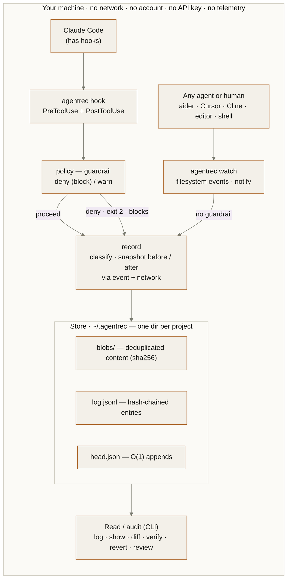
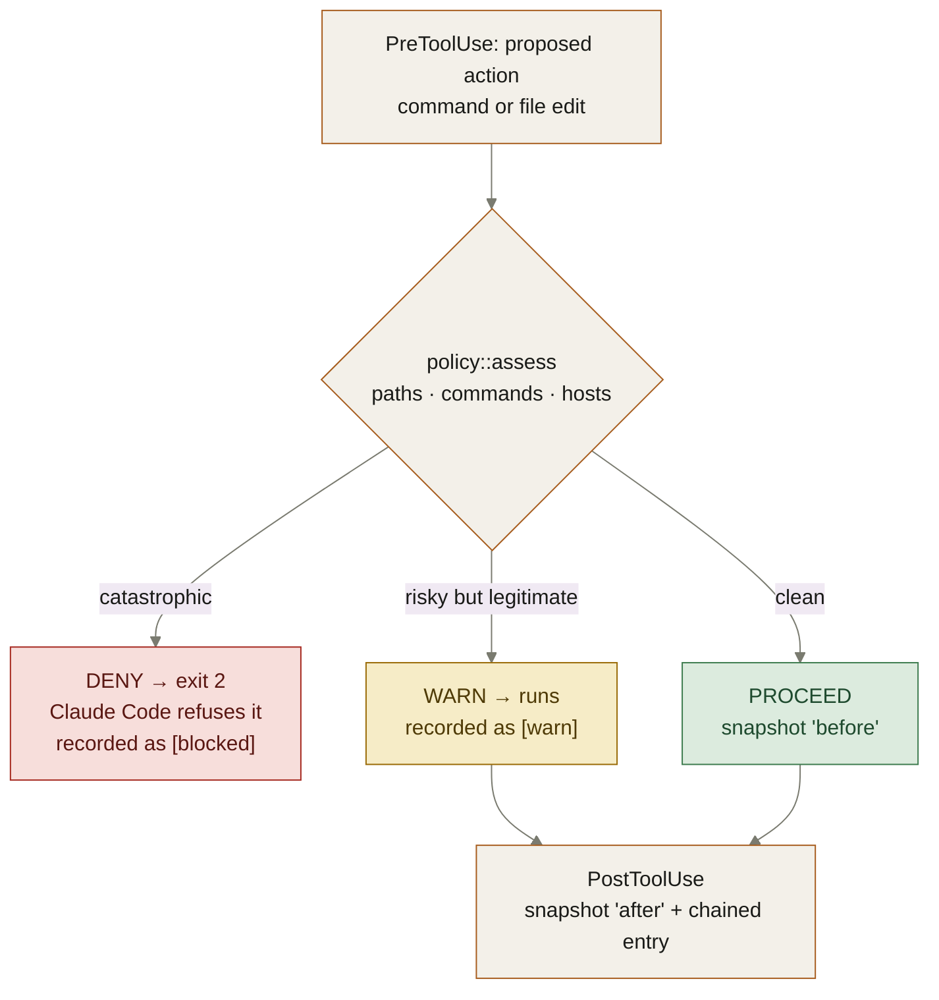

# agentrec architecture

A flight recorder and guardrail for AI coding agents. Every file edit and shell
command an agent makes is recorded **on your own disk**, in a tamper-evident log
you can replay, verify, and undo — and the catastrophic ones are blocked before
they run. No network, no account, no API key.

## Two capture paths, one local core

Claude Code's hooks hand agentrec every tool call; a filesystem watcher catches
edits from any other agent — or your own hands. Both funnel into the same
recorder, which snapshots file contents before and after and appends a chained
entry to a per-project store under `~/.agentrec`. Nothing is uploaded; the whole
loop lives on your machine.

## Hooks for the full record, watch for any agent

Hooks give the fullest record — edits *and* commands, plus the guardrail — but
only Claude Code has them. `watch` is the agent-agnostic half: every agent
ultimately writes files to disk, so the filesystem sees them all.

|                     | Claude Code hooks (`init`)          | Filesystem watch (`watch`) |
| ------------------- | ----------------------------------- | -------------------------- |
| Records             | file edits + shell commands         | file edits                 |
| Works with          | Claude Code                         | any agent or human         |
| Blocks bad actions  | **yes** — before they run           | no — observe-only          |
| Network intent      | yes                                 | yes                        |
| Setup               | `agentrec init` writes settings.json | `agentrec watch` — just run it |

## The guardrail: catastrophes blocked before they run

Before a tool runs, `policy::assess` weighs the action against its paths, command
text, and the hosts it would reach. A short list of high-confidence catastrophes
— a broad `rm -rf`, a download piped into a shell, a write to `~/.ssh` — makes the
hook exit 2, and Claude Code refuses the action. Risky-but-legitimate ones are
recorded with a warning and allowed. A project `.agentrec/policy.toml` tunes the
lists. `watch` skips this step: it sees a change only after it lands on disk, so
it can record but not block.

## A log that can't be quietly rewritten

Each entry's hash is computed over the entry with its own hash field blanked, and
folds in the previous entry's hash. Change any past entry — a command, a byte of a
diff — and every hash after it stops matching. `agentrec verify` walks the chain
and names the first broken link; `revert` restores a file to its recorded
"before" and records the revert as its own entry, so undoing is auditable too.

```mermaid
%%{init: {'theme':'base','themeVariables':{'fontFamily':'monospace','primaryColor':'#F3F0E9','primaryBorderColor':'#A75D1E','primaryTextColor':'#1A1B18','lineColor':'#7A7B70'}}}%%
flowchart LR
  G["GENESIS<br/>000…000"] --> E1
  E1["entry #1<br/>hash = sha256(entry, prev = GENESIS)"] -->|prev_hash| E2
  E2["entry #2<br/>hash = sha256(entry, prev = hash&#8321;)"] -->|prev_hash| E3
  E3["entry #3<br/>hash = sha256(entry, prev = hash&#8322;)"] --> V["agentrec verify<br/>recomputes the chain →<br/>OK · or the first tampered #"]
```

The chain detects any change to an entry that has something after it. Closing the
tail-deletion gap (anchoring / signing) is future work.

---

Dual-licensed under [MIT](../LICENSE-MIT) or [Apache-2.0](../LICENSE-APACHE).
